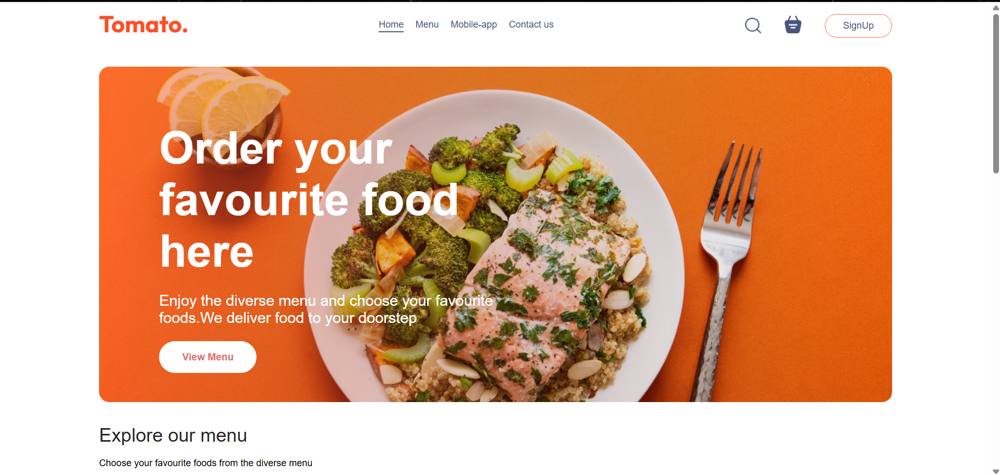
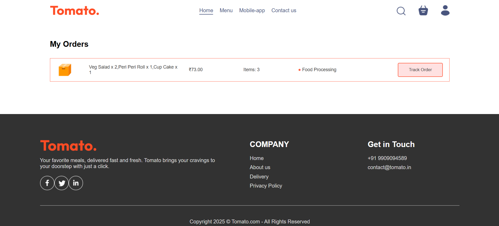

# Food Delivery Project

A **full-stack food delivery application** that connects users with restaurants seamlessly.  
The project includes **three core modules**:  
- **User Frontend**: A responsive React (Vite) app where customers can browse menus, place orders, and track deliveries.  
- **Admin Dashboard**: A secure management system to add food items, manage orders, and view analytics.  
- **Backend API**: A Node.js + Express server with MongoDB integration for handling authentication, orders, and data persistence.  

This application is designed to mimic a **real-world food delivery service** with smooth user experience and robust admin tools.  

---

##  Features

### 1. User Frontend (frontend)
- **Browse Menu**: Explore food items with images, prices, and categories.  
- **Search & Filter**: Quickly find dishes with search and category filters.  
- **Add to Cart**: Add/remove items and view the cart summary.  
- **Order Placement**: Place orders with address + payment details.  
- **Order Tracking**: Track current and past orders with real-time updates
  
### 2. Admin Dashboard (admin)
- **Login Authentication**: Secure access for admins.  
- **Add Food Items**: Upload new dishes with images, descriptions, and prices.  
- **Update/Delete Items**: Edit or remove menu items.  
- **Order Management**: View & manage all user orders.  
- **User Management**: View registered users and manage access.  
- **Dashboard Analytics**: Insights into orders, users, and revenue.  
- **Image Uploads**: Upload and manage food item images.  

### 3. Backend API (backend)
- **RESTful Endpoints**: APIs for users, orders, food, and cart.  
- **JWT Authentication**: Secure login for users & admins.  
- **MongoDB Integration**: Persistent data storage for users/orders/food.  
- **Order Processing**: Creates, updates, and tracks order statuses.  

---

## Screenshots

###  User Frontend
- **Homepage**  
  

- **Explore Menu**  
  

- **Cart Page**  
  

- **Orders Page**  
  

- **Track Order**  
  

- **Payment Page**  
  

---

###  Admin Dashboard
- **Admin Home Dashboard**  
  

- **Order Management**  
  

- **Add Product Page**  
  

---
## 🛠 Tech Stack

This project is built using the **MERN Stack** for full-stack web development:

- **MongoDB** – Database to store users, menus, and orders.  
- **Express.js** – Backend framework for building REST APIs.  
- **React.js** – Frontend library for building an interactive and responsive user interface.  
- **Node.js** – Runtime environment for server-side development.  

### Additional Tools & Libraries

- **Redux Toolkit** – For state management (user authentication, cart, orders).  
- **Axios** – For handling API requests between frontend and backend.  
- **Mongoose** – For modeling and interacting with MongoDB.  
- **JWT (JSON Web Token)** – For secure authentication and authorization.  
- **Multer** – For handling file uploads (e.g., food images).   
- **Git & GitHub** – Version control and project hosting.

